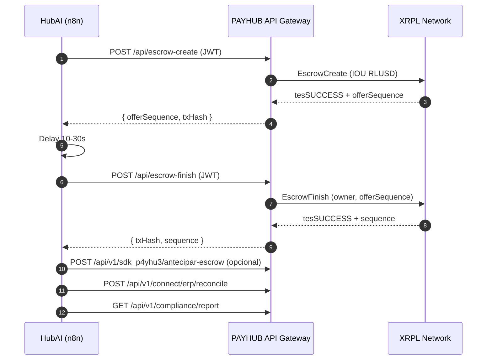
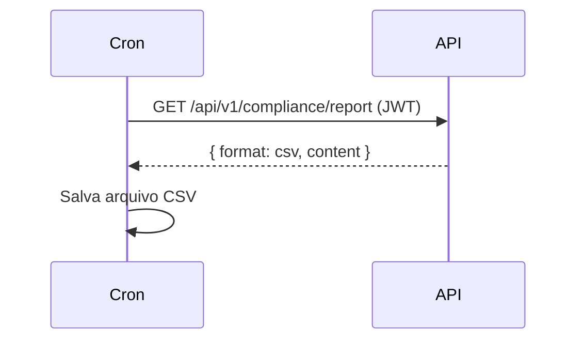
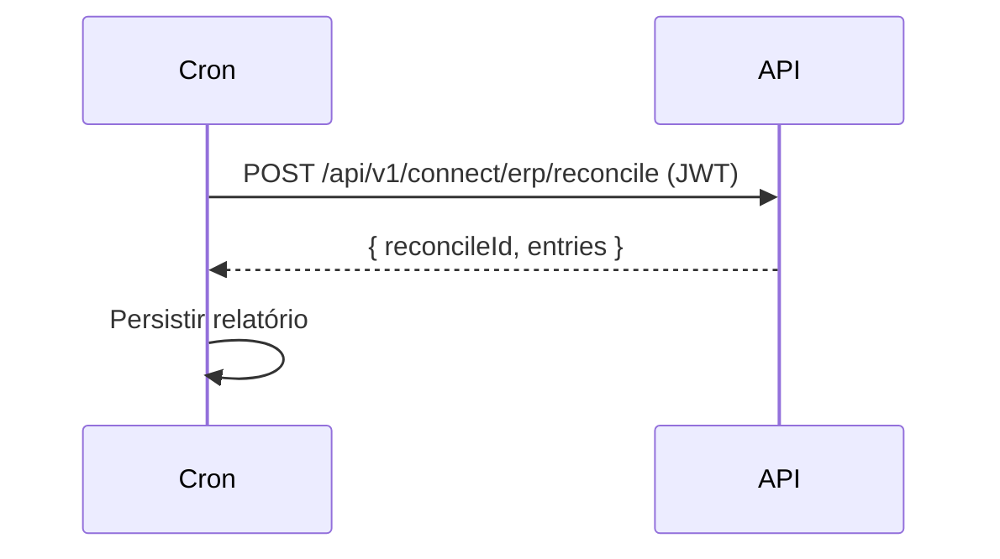
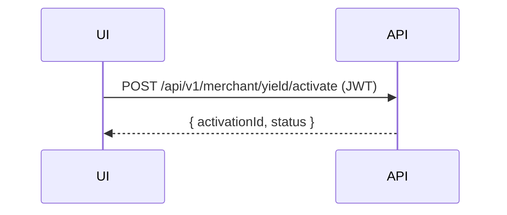
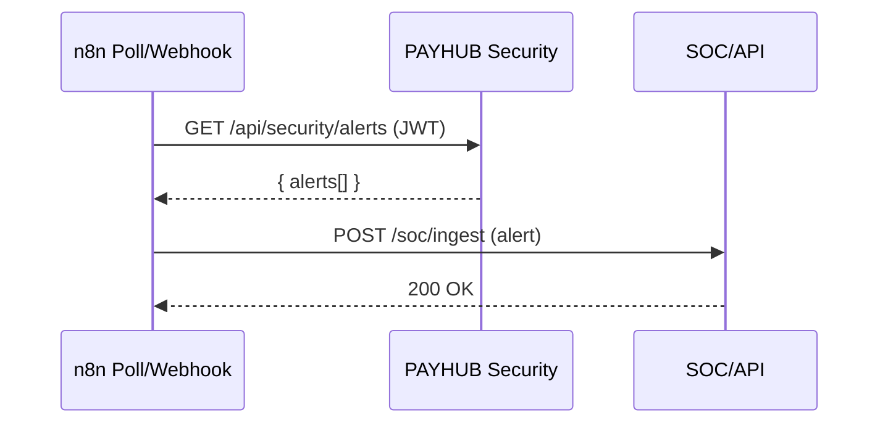

# HubAI — Documentação Técnica de Workflows n8n

Este documento padroniza objetivos, nós, parâmetros, dependências e inclui diagramas de sequência (Mermaid) dos principais fluxos.

## 1) HubAI Escrow Lifecycle
- Objetivo: Executar ciclo E2E de Escrow (Create → Finish), opcionalmente avançar 95% (Payment) e registrar reporting/ERP.
- Nós utilizados:
  - Manual Trigger (inicialização manual)
  - HTTP Request `POST /api/escrow-create`
  - Set (extrair `offerSequence`, `owner`)
  - Wait/Delay (tempo de confirmação)
  - HTTP Request `POST /api/escrow-finish`
  - HTTP Request `POST /api/v1/sdk_p4yhu3/antecipar-escrow` (opcional)
  - HTTP Request `POST /api/v1/connect/erp/reconcile`
  - HTTP Request `GET /api/v1/compliance/report`
- Parâmetros de configuração:
  - Header `Authorization: {{$env.PAYHUB_JWT}}`
  - `XRPL_NETWORK` e `XRPL_WS_URL` configurados no backend
- Dependências externas:
  - Backend PAYHUB (`server.js`), APIs: escrow-create, escrow-finish, sdk, compliance, connect/erp
- Diagrama de sequência:

## 2) Compliance Report Export
- Objetivo: Exportar CSV diário de compliance para auditoria.
- Nós utilizados: Cron → HTTP GET `/api/v1/compliance/report` → Write Binary File
- Parâmetros: `Authorization: {{$env.PAYHUB_JWT}}`, caminho de output
- Dependências: API `/api/v1/compliance/report`
- Diagrama:

## 3) ERP Reconcile
- Objetivo: Conciliar operações com ERP periodicamente.
- Nós: Cron → HTTP POST `/api/v1/connect/erp/reconcile` → Write Binary File (opcional)
- Parâmetros: `periodStart`, `periodEnd`, `Authorization: {{$env.PAYHUB_JWT}}`
- Dependências: API `/api/v1/connect/erp/reconcile`
- Diagrama:

## 4) Yield Activation
- Objetivo: Ativar mecanismo de Yield para conta do comerciante.
- Nós: Manual Trigger → HTTP POST `/api/v1/merchant/yield/activate`
- Parâmetros: `merchantAccount`, `Authorization: {{$env.PAYHUB_JWT}}`
- Dependências: API `/api/v1/merchant/yield/activate`
- Diagrama:

## 5) Honeypot Security Alerts
- Objetivo: Canalizar alertas de Defesa Ativa para SOC/API externo.
- Nós: Webhook/HTTP Poll → Filter (severity) → HTTP Request (SOC/API) → Slack/Email (opcional)
- Parâmetros: `Authorization: {{$env.PAYHUB_JWT}}` para backend; endpoint SOC
- Dependências: Backend Honeypot (`honeypot-system`), endpoint de alertas exposto
- Diagrama:

## Padrões de implementação
- Header `Authorization` sempre via `{{$env.PAYHUB_JWT}}` (JWT curto).
- Nunca persistir tokens, seeds ou PII nos nós.
- Requisições com try/catch no backend; n8n foca em orquestração.